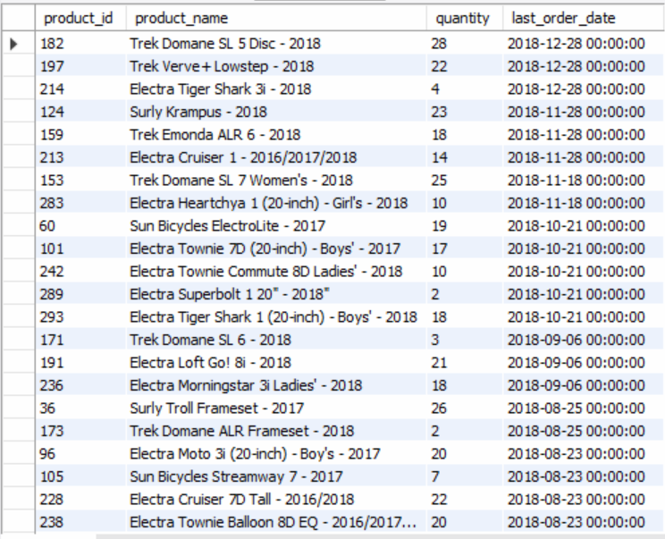
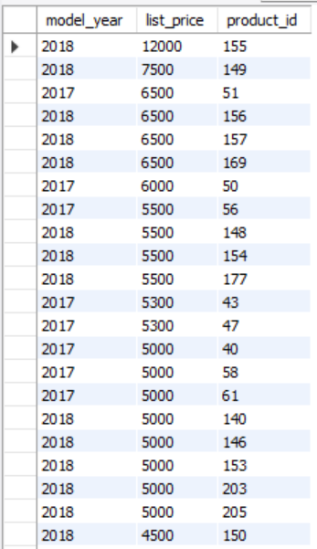
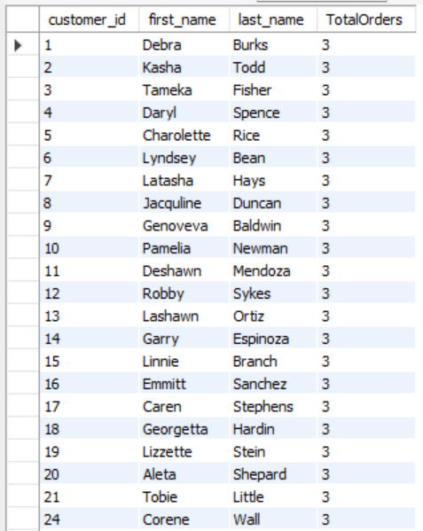
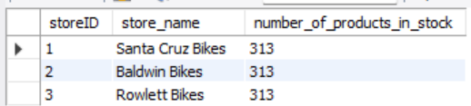
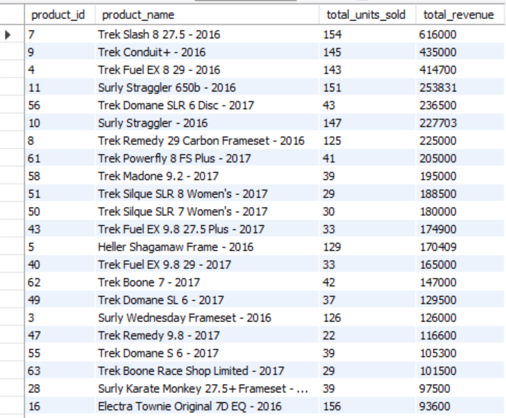

# SQL Project 2 | Group 1
Members: Ben Kim, Jackson Avey, Christian Hertzig, Success Onichabor, Drew Vajda
- Second rendition of the SQL project to include: more complex queries as well as visualizations

## Scenario
The task at hand is to model and build a relational database for the general operations of a network of bike stores. The central entity in the model is the Store entity, representing each individual location where bikes and related products are sold. Each store manages its stock of products, including details such as quantity, category, and brand. The system also tracks orders placed by customers, consisting of multiple order items tied to specific products. Additionally, employees are associated with each store to manage sales and inventory. The product detail entity provides descriptive information about each item, while the categories and brands entities classify and group products effectively. Our goal is to accurately model these relationships, populate the database with sample data, and perform queries that yield useful insights into sales performance, inventory management, and customer purchasing trends across all stores.

## Data Model
Explanation:
The Bike Store data model captures how products, customers, employees, and orders interact across multiple store locations. It is built around a set of well-defined relationships that mirror the real-world structure of a retail business. At the heart of the design is the Product table, which connects to several entities. Each product belongs to exactly one Brand and one Category, forming two one-to-many relationships from Product to Brand and Category. This means a single brand or category can be associated with many products, but each product can only have one brand and one category. The Product_Detail table is linked to Product through a one-to-one relationship because each product has a unique set of detailed attributes such as model year and list price that apply to that specific item only.
Sales transactions are modeled through the Orders and Order_Item tables. The Orders table connects to Customer in a one-to-many relationship since a single customer can place many orders, but each order belongs to only one customer. Each Order can also have multiple items, leading to a one-to-many relationship between Orders and Order_Item. On the other side, each Order_Item references a single Product, but a product can appear in many order items over time, forming another one-to-many relationship from Order_Item to Product. The Order_Item table serves as an associative entity, enabling a many-to-many conceptual link between Orders and Product while storing key transactional attributes like quantity, discount, and price at the item level.
Inventory and store management are supported by the Stores, Stock, and Employee tables. The Stock table connects Stores and Product in a many-to-many relationship implemented through Stock as a bridge entity. Each store carries many products, and each product can be stocked in multiple stores, with quantity levels stored in Stock. The Employee table links to Stores in a one-to-many relationship, showing that multiple employees work in one store. It also has a self-referencing relationship where an employee can manage other employees, modeling a managerial hierarchy within the same table. Finally, Orders connect back to Stores indirectly through Employees and Customers, ensuring that every transaction can be traced to both a customer and a physical location.
Overall, this model efficiently supports business operations such as tracking sales, managing inventory, and organizing staff responsibilities. The chosen relationship types ensure data consistency — for example, every product detail ties to exactly one product, while inventory and sales can scale across multiple stores and customers. This balance of one-to-one, one-to-many, and many-to-many structures provides both normalization and flexibility for future business growth.

## Data Dictionary

## Five Complex Queries

## Database Info Table
## Query Requirements Table

| Requirement              | Query 1 | Query 2 | Query 3 | Query 4 | Query 5 |
|--------------------------|:-------:|:-------:|:-------:|:-------:|:-------:|
| Database information     |   x     |   x     |         |         |   x     |
| Multiple table join      |   x     |   x     |         |   x     |   x     |
| Create view              |         |   x     |         |         |         |
| Group By, Aggregation    |   x     |         |   x     |   x     |   x     |
| Join                     |   x     |   x     |   x     |   x     |   x     |

### Query 1 Screenshot
The query starts by joining stock and product so we can see exactly which items a specific store carries and the quantity currently available. It then connects order_item and orders to each product, which lets us pull the most recent order date for every item that has ever been purchased. The query links stock with product to show which items the store has and how many are available. It also joins order_item and orders so we can see the most recent time each product was ordered. This helps the business track what’s selling, what’s sitting, and when to reorder.

### Query 2 Screenshot
This query creates a view that pulls together product IDs, names, brands, and list prices from the product, brand, and product_details tables. After defining the view, I run a query to show only the products priced over 500 so I can quickly see the higher-priced items. This helps the business identify premium products and compare pricing across different brands.

### Query 3 Screenshot
This query joins customer and orders to find customers who have placed at least two orders. By grouping by each customer and counting their orders, it returns the customer ID, first name, last name, and total number of orders for the most active shoppers. This helps the business quickly spot loyal customers for rewards or targeted marketing.

### Query 4 Screenshot
This query joins stores and stock to count how many distinct products each store has in stock. It filters to only show stores with more than 20 different products and orders them from the most stocked to the least. This helps the business compare store inventory levels and see which locations carry the widest product range.

### Query 5 Screenshot
This query joins product, product_details, and order_item to calculate total units sold and total revenue for each product. It only includes rows where quantity sold is positive and then sorts products from highest to lowest revenue. This lets the business easily see top-earning products and make smarter decisions about pricing, promotions, and inventory.

## Tableau Visualizations

## Visualization One: Total Sales Revenue by Bike Type
Description:
- Chart showcases the total sales revenue generated by each bike type. Helps managers understand  which bike types contribute the most to overall sales revenue.

Relevance:
- By understanding the distribution of revenue amongst bike types, it can help upper management identify which product lines generate the most sales. This can later go on to inform data-driven decisions such as: inventory prioritization, marketing tactics, etc.

## Visualization Two: Total Stock by Bike Type
Description: 
- Chart shows the total amount of inventory held for each bike type.

Relevance: 
- Upper management, as well as store owners, can make informed decisions by evaluating the total stock of each bike type with important metrics such as revenue and # of orders --> customer demand. For example, a bike type with higher stock but lower revenue generated can help store owners optimize their stock.

## Visualization Three: Total Orders by Bike Type
Description:
- Chart shows the total number of orders placed by customers for each bike type.

Relevance:
- This chart is especially important in highlighting purchase trends across the different bike offerings. Volume of orders can help provide insight into market/customer trends. Furthermore, nu comparing total # of orders to metrics such as revenue and inventory, store owners can identify top-selling types and match the current market better.

The Name of the Database is: cs_bck81809
